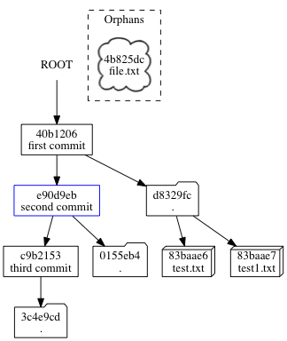

git-dag-graph
=============

A tool for rendering a subset of the Git Graph. Intended to make visualizing Git internals easier. No guarantees regarding efficacy.

Initial goals would be to generate a graph similar to the following:

(source: [graph.dot](README_assets/graph.dot))
